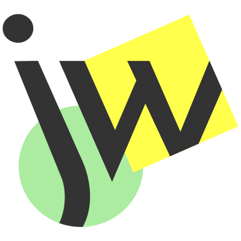

  

My passion is an intuitive, aesthetic web. My job is to make that a reality for you. I am currently doing this with tools like Gatsby.js and Next.js.

built with [gatsby](https://www.gatsbyjs.org/), [react](https://reactjs.org/), [netlify](https://www.netlify.com/), and [contentful](https://www.contentful.com/) ❤️

<h3>Bio</h3>

  

 

<h3>Portfolio</h3>

  

 

<h3>Contact</h3>

  

 

<h3>Mobile Nav</h3>

  

 
